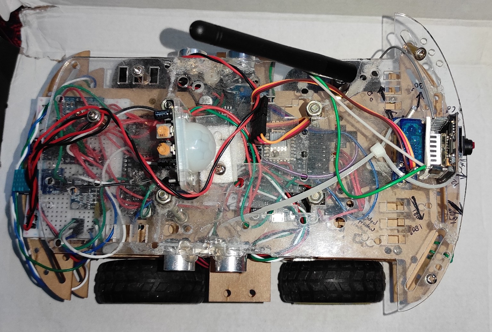
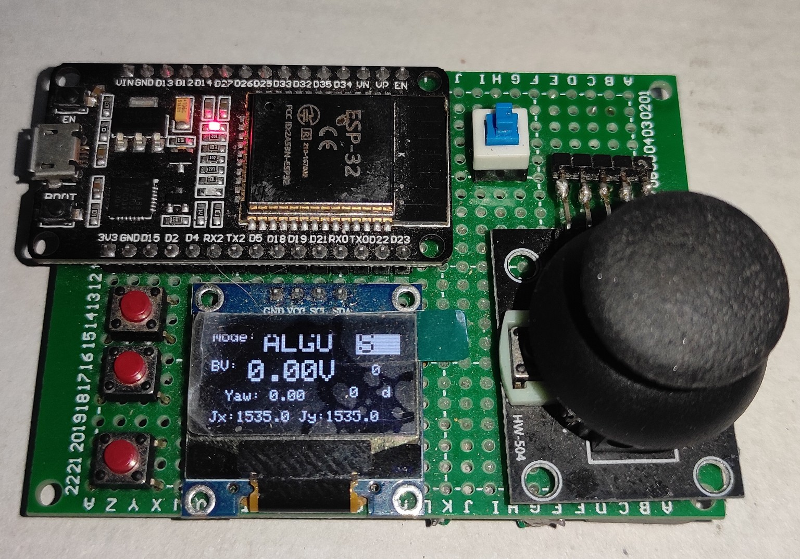

> 🛠️ Developed entirely by **Naitik Srivastava** (B.Tech ECE, UIET BBAU)

## 📚 Table of Contents
- [Introduction](#-introduction)
- [Hardware Architecture](#-hardware-architecture)
- [Communication System](#-communication-system)
- [Operational Modes](#️-operational-modes)
- [Web Interface](#-web-interface)
- [Power Stability](#-power-stability)
- [Why This Project is Special](#-why-this-project-is-special)
- [Applications](#-applications--real-world-use-cases)
- [Folder Structure](#-folder-structure)
- [Source Code Includes](#-source-code-includes)
- [Final Thoughts](#-final-thoughts)

Project Overview – A.X.I.O.N. - 
Adaptive eXploration & Intelligent Observation Node  By: Naitik Srivastava
University: Babasaheb Bhimrao Ambedkar University, UIET – Department of Electronics and Communication Engineering
Development Budget: ₹11,000 (initial prototype) → optimized under ₹4,000

 Introduction
A.X.I.O.N. (short for Adaptive eXploration & Intelligent Observation Node) is more than just a robot — it’s a personal passion project, born out of curiosity and built with a deep desire to solve real-world problems using embedded systems, low-cost electronics, and smart sensor integration.

 Rover Prototype Photo

🎮 Master Controller (Remote Unit)

The project started as a simple goal: build a rover that can detect obstacles and move around. But as it evolved, so did its capabilities. It became an intelligent node capable of streaming video, drawing live maps of its environment, and operating in complete autonomy — all without relying on the internet.

A.X.I.O.N. is fully modular, smart, and designed to operate in two modes: manual (using a joystick remote) and autonomous (under development). What sets it apart is that the entire system is internet-free — no routers, no cloud servers, and no hidden dependencies. It can operate completely offline in remote or critical environments like caves, disaster zones, or border areas. All control and data exchange is done via low-latency ESP-NOW communication.

And most importantly: it’s fully self-made. Every line of code, every wire connection, and every design decision was taken without external help — just the developer, the tools, and an idea that kept growing.

🧰 Hardware Architecture
The A.X.I.O.N. rover is compact but densely packed with sensors and logic boards, all working together in a finely tuned dance. Here’s a deep look into the hardware setup:

🔩 Dimensions
Length: 27 cm

Width: 10 cm

Height: 17 cm

🧠 Microcontrollers Used
3x ESP8266 boards:

One handles motor control using L293D

One is dedicated to sensor aggregation

One handles inter-board communication

1x ESP32-CAM:

Provides a live FPV camera stream

Operates in SoftAP mode, streaming directly to browsers

1x ESP32 (on joystick remote):

Serves as central controller + web server

Hosts UI, maps, control panel, and joystick input

⚙️ Motor Control
L293D motor driver

Drives 2x DC motors

Receives movement commands wirelessly via ESP-NOW

🧭 Sensors & Modules
MPU6050 – orientation sensor for precise yaw tracking

GY-271 Magnetometer – for absolute directional heading

Ultrasonic Sensor (on Servo) – scans left, center, and right for obstacle mapping

BMP280 – provides altitude, temperature, and pressure data

PIR Sensor – detects motion in surroundings

IR Sensors (optional for line following or edge detection)

Hall Sensor + Magnet (planned) – for wheel encoder implementation

OLED Display – real-time onboard feedback

Joystick Module + Buttons – controls direction, toggles modes

🔋 Power System
Dedicated 5V voltage regulators for each microcontroller

Powered using Li-ion rechargeable batteries

Ensures clean and consistent power — crucial for camera stability, motor torque, and sensor reliability

📡 Communication System
🚀 ESP-NOW Protocol
Low-latency wireless protocol used between ESP32 (remote) and ESP8266s on the rover

No need for routers or internet

Ideal for real-time command transmission and data collection

📷 ESP32-CAM (SoftAP Mode)
Creates its own Wi-Fi network

Hosts a live SVGA (800x600) video stream

Accessible via any browser without internet
and can be viewed on a Virtual Reality Box

Future plans: AI-based gesture/face/object recognition to improve autonomous decisions

🕹️ Operational Modes
1. Manual Mode – Joystick Control
Controlled by a remote unit with joystick + buttons + OLED

ESP32 on the remote:

Sends movement commands: F (forward), B (back), L (left), R (right), S (stop)

Receives sensor data from rover

Renders live map + video + data on a local web page

Map is grid-based and dynamically follows rover

Uses yaw data (MPU6050 + Magnetometer) and distance (planned) to track movement

Map visually highlights:

Rover position

Heading

Obstacles (as red dots) from ultrasonic scan

Map is rendered in real time using WebSockets and can be saved as JPEG

2. Autonomous Mode – Smart Navigation (WIP)
Activated with a mode toggle on the remote

Uses:

Ultrasonic + Servo for 180° scanning

MPU6050 for yaw tracking

Logic:

Scans left, center, and right

Picks direction with max free space

Rotates to that heading with ±2° yaw accuracy

Moves forward

If all directions are blocked:

Turns 90° to the left

Uses same live map and data display as manual mode

Future: Object detection using ESP32-CAM (e.g. recognize signs, detect humans, avoid certain objects)

🌐 Web Interface
The interface is hosted directly by the ESP32 (remote unit) and is fully offline.

Features:
Live 2D grid map that follows the rover

Sensor data overlays (temp, pressure, yaw, obstacles, etc.)

Auto-follow camera view via ESP32-CAM

Option to snapshot map as JPEG

Responsive design that works on mobile and desktop

Tech Stack:
HTML, CSS, JavaScript

WebSocket for real-time data updates

Canvas used for drawing maps

No internet = No lag, No risk

🔋 Power Stability
Power is often the weakest point of embedded systems. Not here.

Each microcontroller and high-draw component has its own regulator

Prevents common brownout issues on ESP boards

Clean power ensures:

Stable camera stream

Uninterrupted WebSocket data

Accurate sensor reads

No motor jitter

💡 Why This Project is Special
Completely self-built: no external code, no plug-and-play modules

Problem-solving focus: built to solve navigation, exploration, and automation challenges

Low-cost, high-efficiency: optimized from ₹10,000 prototype to ₹4,000 production

Real-time and offline: maps, controls, and FPV work with zero internet dependency

Scalable: ready for AI integration, better sensors, GPS, long-range radios

🔍 Applications & Real-World Use Cases
This isn't just a school project. A.X.I.O.N. has practical, real-world applications:

🔥 Disaster Search and Rescue
Navigate collapsed buildings, tunnels, or caves with onboard sensors and camera

⚠️ Mine Detection Rover
Equipped with metal/gas sensors, it can scan risky zones autonomously

🕵️ Military & Border Surveillance
Silent, low-cost patrol bot for off-grid operations with FPV and motion sensors

📦 Autonomous Delivery Bots
Navigate within campuses, hospitals, or factories without needing internet

🧪 Remote Exploration
Perfect for caves, forests, or abandoned sites where GPS and Wi-Fi fail

🎓 STEM & Research Education
Fully documented, modular, and easy to build upon — ideal for students

🗂️ Folder Structure
A.X.I.O.N/
├── README.md
├── docs/
│   └── Project_Overview.md
├── media/
│   ├── rover.jpg
│   ├── mapping_ui.png
│   └── fpv_demo.mp4
├── webpages/
│   ├── control_ui/
│   ├── mapping_ui/
│   └── fpv_ui/
├── rover/
│   ├── espcam_fpv/
│   ├── radar_module/
│   ├── data_packager/
│   └── main_controller/
├── master/
│   └── esp32_remote/
💻 Source Code Includes
All ESP32/ESP8266 Arduino sketches

Modular web interface code (HTML, CSS, JS)

WebSocket & serial logic

AI integration hooks (for future object recognition, decision-making)

A.X.I.O.N. isn't just a robot — it's a vision of what low-cost, DIY robotics can achieve when thoughtfully designed and passionately built. It's modular, powerful, and built for real-world challenges. With proper support, this project can scale into a highly capable exploration platform used in defense, disaster relief, research, and beyond.
